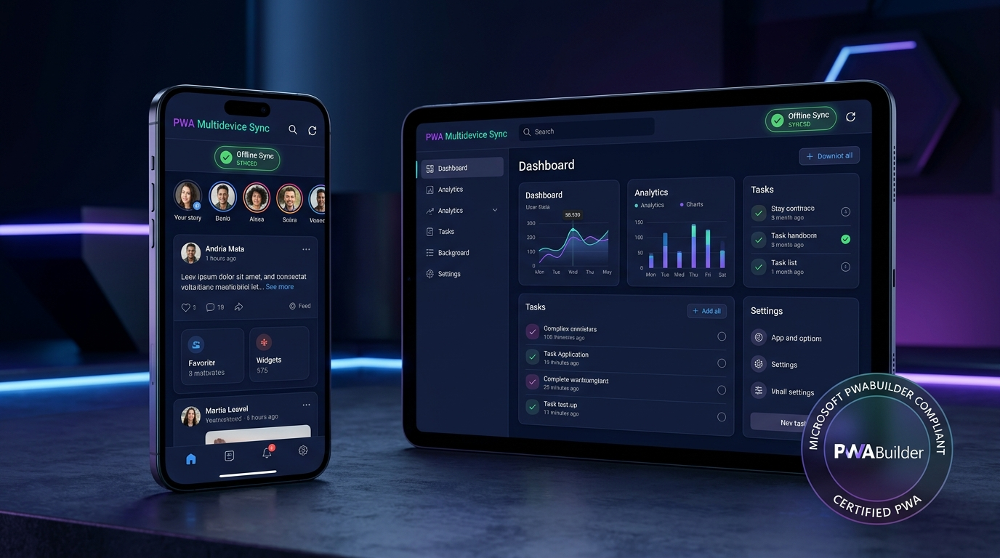

# 💳 Stripe & Gmail Payment Gateway Hub (PWA)

> **সম্পূর্ণ নিরাপদ লোকাল Stripe টেস্ট প্যানেল, পেমেন্ট সিমুলেটর, সাবস্ক্রিপশন ম্যানেজার, ওয়েবহুক ইন্সপেক্টর এবং স্বয়ংক্রিয় Gmail পেমেন্ট রসিদ অর্গানাইজার।**
> 
> *An enterprise-grade, privacy-first local Stripe development suite & official Google Workspace Gmail integration with 100% PWABuilder compliance.*

<p align="center">
  
</p>

---

## 🌟 মূল বৈশিষ্ট্যসমূহ (Key Features)

### 1. ⚡ Stripe কী যাচাইকারী ও স্যান্ডবক্স (Key Verifier & Sandbox)
- **নিরাপদ কী যাচাই**: আপনার Stripe Publishable Key (`pk_test_...`) এবং Secret Key (`sk_test_...`) ব্রাউজার থেকে সরাসরি টেস্ট মোডে লাইভ ভ্যালিডেট করে।
- **জিরো ডেটা লিক**: কোনো সার্ভারে সিক্রেট কী ডাটাবেজে পারসিস্ট হয় না; মেমোরিতে নিরাপদে পরীক্ষা হয়।
- **ব্যালেন্স ও অ্যাকাউন্ট ইনফো**: কারেন্সি, লাইভ/টেস্ট মোড স্ট্যাটাস, পেআউট সক্ষমতা ইত্যাদি প্রদর্শন।

### 2. 💳 পেমেন্ট সিমুলেটর ও বায়োমেট্রিক 3DS2 (Payment Simulator)
- **কার্ড পেমেন্ট (Stripe Elements)**: ক্রেডিট/ডেবিট কার্ড টেস্ট নম্বর দিয়ে লাইভ চার্জ সিমুলেশন।
- **3D Secure (3DS) বায়োমেট্রিক/ওটিপি যাচাই**: `pm_card_authenticationRequiredOnSetup` এবং `3DS2` চ্যালেঞ্জ ফ্লো সিমুলেশন।
- **মোবাইল ওয়ালেট ও একাধিক মেথড**: Google Pay, Apple Pay ও লোকাল পেমেন্ট মেথড সাপোর্ট।

<p align="center">
  
  <em style="color: #94a3b8; font-size: 13px;">চিত্র: Stripe Elements ইন্টিগ্রেশন, 3D Secure বায়োমেট্রিক অথেন্টিকেশন এবং স্বয়ংক্রিয় রসিদ তৈরি ফ্লো</em>
</p>

### 3. 🔄 সাবস্ক্রিপশন ও বিলিং ম্যানেজার (Subscription Manager)
- পুনরাবৃত্ত বিলিং (Recurring Plans - Basic, Pro, Enterprise) সিমুলেশন।
- ট্রায়াল পিরিয়ড, কুপন ডিসকাউন্ট ও ইনভয়েস প্রিভিউ।

### 4. 📡 ওয়েবহুক স্টুডিও (Webhook Studio)
- Stripe Webhook ইভেন্ট সিমুলেশন (`payment_intent.succeeded`, `charge.refunded`, `customer.subscription.created` ইত্যাদি)।
- রিয়েল-টাইম পেলোড ইন্সপেক্টর ও এইচটিটিপি পোস্ট টেস্টিং।

### 5. 📬 Gmail রসিদ হাব ও অটো-অর্গানাইজার (Gmail Receipts Hub)
- **অফিসিয়াল Google Workspace OAuth**: কোনো থার্ড পার্টি সার্ভার ছাড়াই ক্লায়েন্ট-সাইড টোকেনের মাধ্যমে নিরাপদ সংযোগ।
- **Stripe হেডার স্ক্যানিং**: ইনকামিং ইমেইলের মেটাডাটা হেডারে Stripe-নির্দিষ্ট প্যারামিটার (`X-Stripe-Account`, `X-Stripe-Event`, `Feedback-ID`, `stripe.com`) স্ক্যান করে।
- **`ensurePaymentLabelExists`**: Gmail API-এর মাধ্যমে ব্যবহারকারীর ইনবক্সে 'Payments' লেবেল আছে কিনা তা যাচাই করে বা স্বয়ংক্রিয়ভাবে নতুন লেবেল তৈরি করে।
- **Auto-Labeling upon Fetch**: ইমেইল ফেচ করার সাথে সাথেই অননুমোদিত বা অগোছালো Stripe রসিদে 'Payments' লেবেল লাগিয়ে সাজিয়ে দেয়।
- **এক-ক্লিকে রসিদ প্রেরণ (`sendGmailReceipt`)**: গ্রাহককে কাস্টমাইজড HTML বিলিং রসিদ ইমেইল পাঠানোর সুবিধা।

### 6. 📱 পূর্ণাঙ্গ PWA ও PWABuilder রেডি (PWA & Offline Service Worker)
- **100% PWABuilder স্কোর**: মাইক্রোসফট PWABuilder এবং W3C স্ট্যান্ডার্ড অনুযায়ী তৈরি।
- **ইন-অ্যাপ ইনস্টল প্রম্পট**: ব্রাউজার বার ছাড়াও অ্যাপের ভেতর থেকে অ্যান্ড্রয়েড, উইন্ডোজ, ম্যাক বা আইওএস-এ এক ক্লিকে ইনস্টল (`PWAInstallButton`)।
- **iOS Safari গাইড**: আইফোনে Safari-এর "Add to Home Screen" অপশনের নির্দেশনামূলক মডাল।
- **সার্ভিস ওয়ার্কার ও ক্যাশ ইন্সপেক্টর (`/sw.js`)**: Workbox ক্যাশিং, অফলাইন মোড ডিটেকশন ও রিয়েল-টাইম ক্যাশ ম্যানেজমেন্ট।

<p align="center">
  
  <em style="color: #94a3b8; font-size: 13px;">চিত্র: মাল্টি-ডিভাইস রেসপন্সিভ প্রোগ্রেসিভ ওয়েব অ্যাপ (PWA) এবং PWABuilder স্টোর প্যাকেজিং রেডি ইন্টারফেস</em>
</p>

---

## 🛠️ প্রযুক্তি স্ট্যাক (Tech Stack)

| কম্পোনেন্ট | প্রযুক্তি |
| :--- | :--- |
| **Frontend UI** | React 19, TypeScript, Tailwind CSS v4, Lucide Icons, Motion |
| **Bundler & PWA** | Vite 8, `vite-plugin-pwa`, Workbox, Native Manifest |
| **Backend Proxy** | Node.js, Express, TSX, Dotenv |
| **Payments** | Stripe Node SDK (`stripe`), Stripe JS (`@stripe/stripe-js`) |
| **Authentication** | Firebase Auth (Google Sign-In) |
| **Google APIs** | Gmail REST API v1 (Google Workspace Integration) |

---

## 🚀 লোকাল রান করার নিয়ম (Getting Started)

### ১. ডিপেন্ডেন্সি ইনস্টল করুন
```bash
npm install
```

### ২. এনভায়রনমেন্ট ভেরিয়েবল কনফিগার করুন
`.env.example` ফাইলটি কপি করে `.env` তৈরি করুন:
```bash
cp .env.example .env
```

প্রয়োজনীয় ফিল্ডসমূহ পূরণ করুন (ঐচ্ছিক, অ্যাপের ভেতরেও কী ইনপুট দেওয়া যায়):
```env
# Stripe Test API Keys
STRIPE_SECRET_KEY=sk_test_51...
VITE_STRIPE_PUBLISHABLE_KEY=pk_test_51...

# Dev Server Port
PORT=3000
```

### ৩. ডেভেলপমেন্ট সার্ভার চালু করুন
```bash
npm run dev
```
ব্রাউজারে ওপেন করুন: `http://localhost:3000`

---

## 📂 প্রোজেক্টের গঠন (Project Structure)

```text
├── index.html                  # PWA মেটা ট্যাগ, থিম কালার ও আইকন ডিক্লারেশন
├── package.json                # প্রোজেক্ট ডিপেন্ডেন্সি ও স্ক্রিপ্ট
├── server.ts                   # Express ব্যাকএন্ড প্রক্সি ও Stripe API এন্ডপয়েন্ট
├── tsconfig.json               # TypeScript কনফিগারেশন ও PWA টাইপস
├── vite.config.ts              # Vite কনফিগ, Tailwind এবং VitePWA প্লাগইন
│
├── public/                     # PWA আইকন ও স্ট্যাটিক ফাইল
│   ├── apple-touch-icon.png    # iOS Safari আইকন (180x180)
│   ├── favicon.ico             # ব্রাউজার ফেভিকন
│   ├── icon.svg                # ভেক্টর ব্র্যান্ড আইকন
│   ├── pwa-192x192.png         # অ্যান্ড্রয়েড হোমস্ক্রিন আইকন
│   ├── pwa-512x512.png         # স্প্ল্যাশ স্ক্রিন আইকন
│   └── pwa-maskable-512x512.png# স্কুইরকল / সার্কেল মাস্কেবল আইকন
│
└── src/
    ├── App.tsx                 # মূল ড্যাশবোর্ড ও নেভিগেশন লেআউট
    ├── firebase.ts             # Firebase Authentication কনফিগারেশন
    ├── main.tsx                # React এন্ট্রি পয়েন্ট ও সার্ভিস ওয়ার্কার রেজিস্ট্রেশন
    │
    ├── components/             # রিইউজেবল UI কম্পোনেন্টস
    │   ├── ConfirmEmailModal.tsx      # ইমেইল প্রেরণের কনফার্মেশন মডাল
    │   ├── DeploymentGuideTab.tsx     # ডেপ্লয়মেন্ট গাইড ও কোড স্নপেট
    │   ├── GmailInboxTab.tsx          # Gmail ইনবক্স ও রসিদ ম্যানেজার
    │   ├── GoogleSignInButton.tsx     # অফিশিয়াল Google Sign-In বাটন
    │   ├── KeyVerifierTab.tsx         # Stripe কী ভ্যালিডেশন ট্যাব
    │   ├── OfflineIndicator.tsx       # অফলাইন নেটওয়ার্ক স্ট্যাটাস নোটিফিকেশন
    │   ├── PaymentSimulatorTab.tsx    # কার্ড ও 3DS পেমেন্ট সিমুলেটর
    │   ├── PWAInstallButton.tsx       # ইন-অ্যাপ PWA ইনস্টল বাটন
    │   ├── PWABuilderModal.tsx        # PWABuilder স্কোর ও সার্ভিস ওয়ার্কার অডিট
    │   ├── SubscriptionTab.tsx        # সাবস্ক্রিপশন ও বিলিং টেস্ট প্যানেল
    │   └── WebhookStudioTab.tsx       # Stripe ওয়েবহুক সিমুলেটর
    │
    ├── hooks/                  # কাস্টম রিঅ্যাক্ট হুক্স
    │   ├── useOnlineStatus.ts  # লাইভ নেটওয়ার্ক কানেক্টিভিটি হুক
    │   └── usePWAInstall.ts    # PWA installability ও standalone ডিটেক্টর
    │
    └── services/               # সার্ভিস ও API ইন্টিগ্রেশন
        └── gmail.ts            # Gmail API, লেবেল সৃষ্টি ও Stripe হেডার স্ক্যানিং
```

---

## 🛡️ নিরাপত্তা ও গোপনীয়তা নীতি (Security)

1. **কোনো সিক্রেট কী লিক নয়**: সিক্রেট কী ব্রাউজারের কোনো ট্রাফিক বা পাবলিক নেটওয়ার্কে প্রকাশিত হয় না।
2. **ক্লায়েন্ট-সাইড OAuth**: Google Workspace OAuth শুধুমাত্র ক্লায়েন্ট ব্রাউজারে টোকেন গ্রহণ করে, যা সরাসরি গুগল এপিআই-এর সাথে এনক্রিপ্টেড সংযোগ রক্ষা করে।
3. **টেস্টিং মোড সীমাবদ্ধতা**: এটি বিশেষভাবে লোকাল টেস্ট ও স্যান্ডবক্স পরিবেশের জন্য ডিজাইন করা হয়েছে যাতে অসাবধানতাবশত প্রোডাকশন অ্যাকাউন্ট চার্জ না হয়।

---

## 📄 লাইসেন্স (License)

এই প্রজেক্টটি MIT লাইসেন্সের অধীনে উন্মুক্ত। যেকোনো প্রজেক্ট বা ব্যবসায়িক প্রয়োজনে এটি স্বাধীনভাবে ব্যবহার ও সম্প্রসারণ করতে পারেন।
